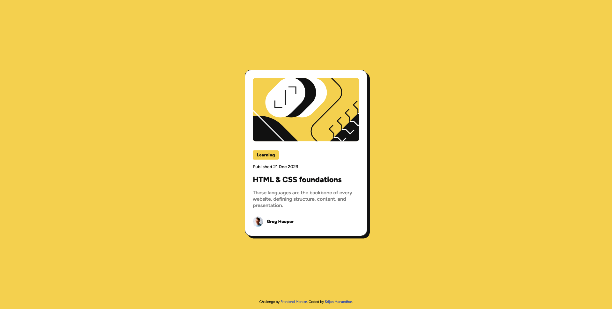
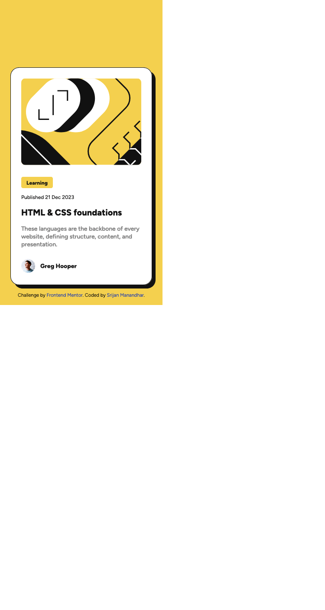

# Frontend Mentor - Blog preview card solution

This is a solution to the [Blog preview card challenge on Frontend Mentor](https://www.frontendmentor.io/challenges/blog-preview-card-ckPaj01IcS). Frontend Mentor challenges help you improve your coding skills by building realistic projects.

## Table of contents

- [Overview](#overview)
  - [Screenshot](#screenshot)
  - [Links](#links)
- [My process](#my-process)
  - [Built with](#built-with)
  - [What I learned](#what-i-learned)
  - [Continued development](#continued-development)
  - [Useful resources](#useful-resources)
- [Author](#author)

## Overview

### Screenshot




### Links

- Solution URL: [https://github.com/srijanss/blog-preview-card](https://github.com/srijanss/blog-preview-card)
- Live Site URL: [https://srijanss.github.io/blog-preview-card/](https://srijanss.github.io/blog-preview-card/)

## My process

### Built with

- Semantic HTML5 markup
- CSS custom properties
- CSS Grid

### What I learned

```css
.blog-preview-card:hover {
  box-shadow: 16px 16px 0 0 var(--black-color);
}
.blog-preview-card:hover .post-title {
  color: var(--primary-color);
}

.blog-image {
  height: var(--blog-image-height);
  background-image: url("./assets/images/illustration-article.svg");
  background-repeat: no-repeat;
  background-size: cover;
  background-position: center center;
  border-radius: 10px;
}
```

In our learning journey, we discovered the use of hover state for an element and use of background-image.

In order to match the active component styles in the design we have used hover state on div and based on that we changed the styles of required components.

Similaryly, to match the mobile design we used background-image property instead of just using img element to show the blog image. We got to know about different CSS background properties and how to use it.
And for responsive design we've used media query for mobile layout.

### Continued development

For mobile layout instead of using media queries we can also use Javascript to change the layout styles. Based on the width and height of the device viewport we can change the corresponding element styles. But in this project we have not used any JS, so we have just used media queries for responsiveness.
In future projects, we plan to use JS.

### Useful resources

- [MDN web docs](https://developer.mozilla.org/en-US/docs/Web/CSS) - This helped me understand background CSS property. Used this reference to set background-image property.

## Author

- Website - [Srijan Manandhar](ttps://github.com/srijanss)
- Frontend Mentor - [@srijanss](https://www.frontendmentor.io/profile/srijanss)
